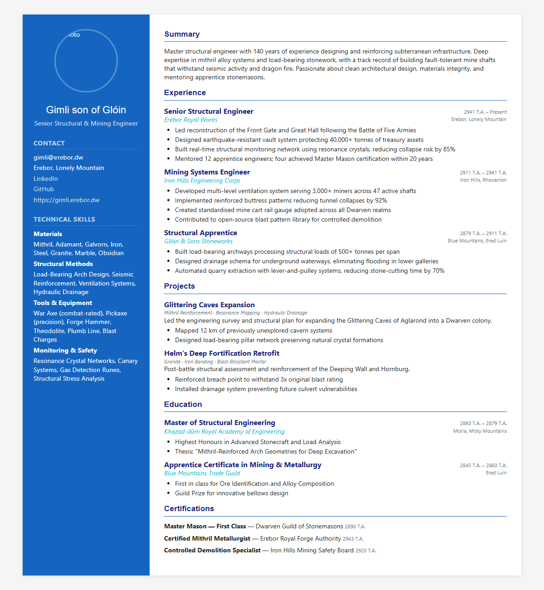
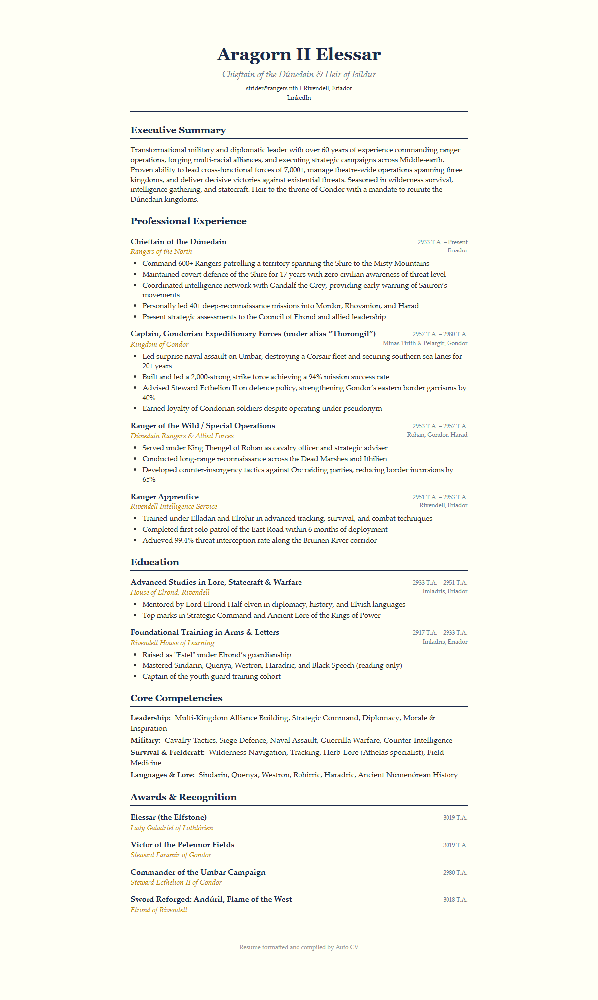
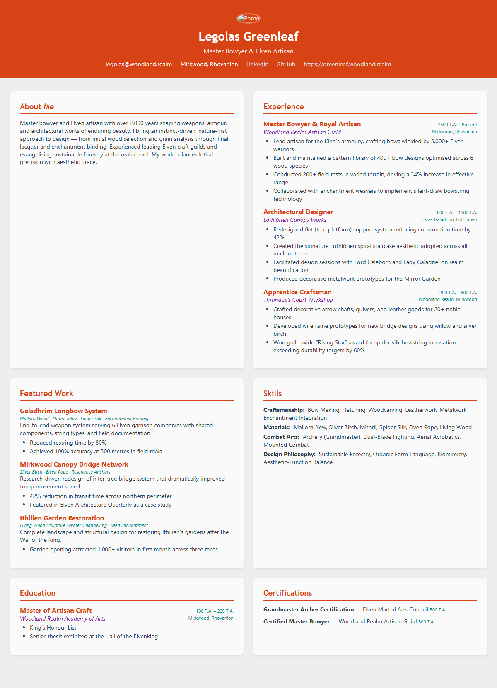
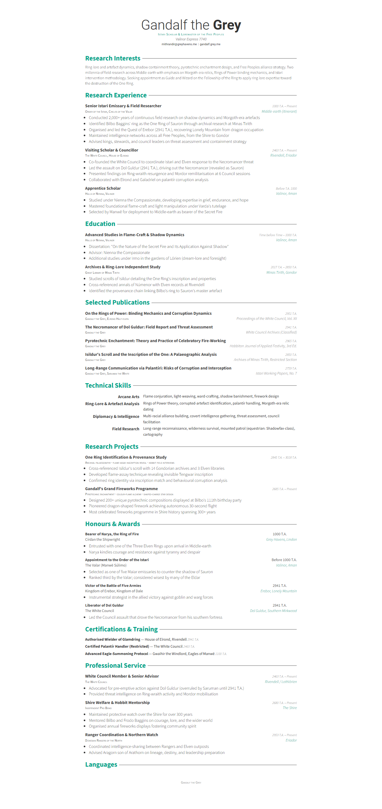
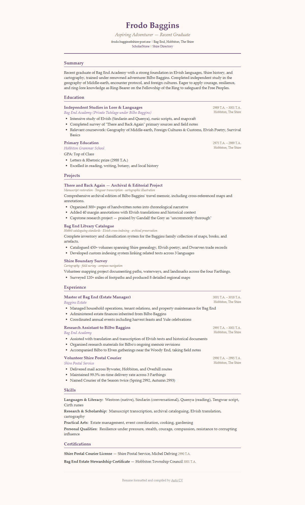
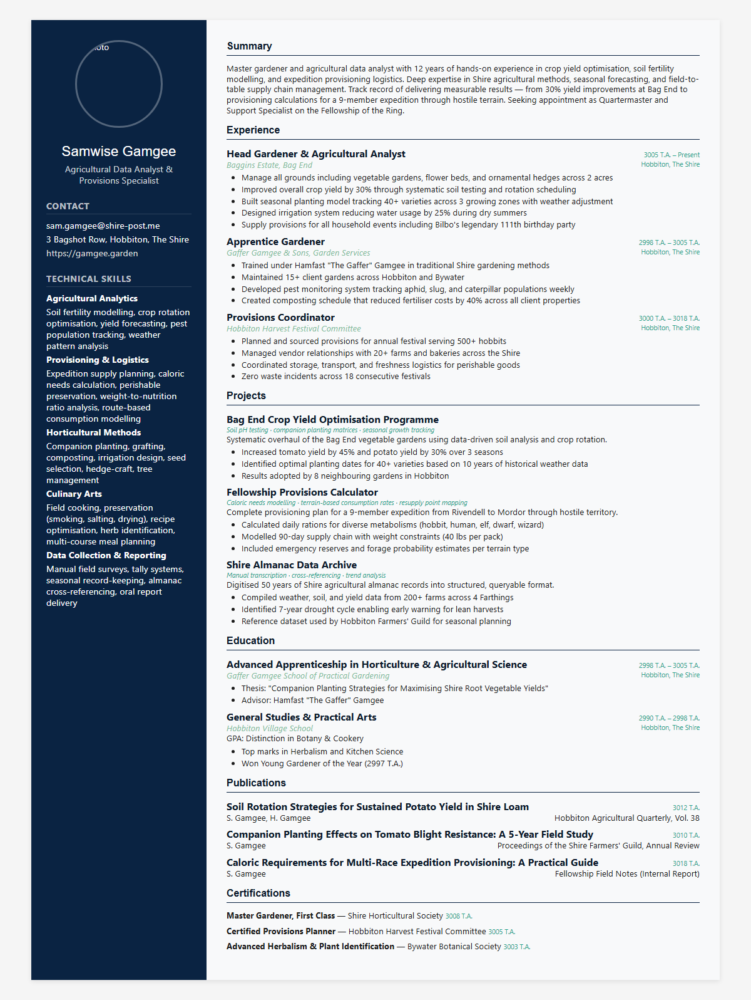

# Auto CV

Auto CV generates a resume website, a Word document, and LaTeX/PDF output from a single markdown-based source.

It is intended for people who want to maintain resume content once and publish it consistently across web, DOCX, and PDF formats without managing separate files for each output.

## Overview

- Single-source resume authoring with HTML, DOCX, and LaTeX/PDF output.
- Built-in presets for technical, executive, academic, creative, and general-purpose resume styles.
- Markdown-first workflow that works well in Obsidian or a standard folder-based project.
- Support for shared master vaults with multiple project-specific resume variants.
- Complete example vaults included in [examples/](examples/).

## Output Formats

| Format | Description |
| --- | --- |
| **HTML** | A responsive resume site with six layouts, print styling, support for extra pages, and optional custom CSS/JS |
| **DOCX** | A Word document generated with `python-docx`, suitable for further editing in Word or Google Docs |
| **LaTeX/PDF** | A structured LaTeX project (`main.tex`, `resume.sty`, `sections/*.tex`) with optional `latexmk` compilation |

## Recommended Starting Point

The most direct way to evaluate the project is to build one of the included example vaults.

```bash
pip install -e .

auto-cv build examples/software-engineer
auto-cv preview examples/software-engineer
```

By default, generated files are written to `output/html/`, `output/docx/`, and `output/latex/`.

## Example Vaults

The repository includes eight complete example vaults in [examples/](examples/). Each example uses a different preset and content profile.

| Example | Sample Profile | Preset | Layout | Build |
| --- | --- | --- | --- | --- |
| [software-engineer](examples/software-engineer) | Gimli son of Glóin, Senior Structural & Mining Engineer | `modern` | `sidebar` | `auto-cv build examples/software-engineer` |
| [executive](examples/executive) | Aragorn II Elessar, Chieftain of the Dúnedain & Heir of Isildur | `executive` | `top-header` | `auto-cv build examples/executive` |
| [creative-designer](examples/creative-designer) | Legolas Greenleaf, Master Bowyer & Elven Artisan | `creative` | `cards` | `auto-cv build examples/creative-designer` |
| [academic-researcher](examples/academic-researcher) | Gandalf the Grey, Istari Scholar & Loremaster of the Free Peoples | `awesome-cv` | `top-header` | `auto-cv build examples/academic-researcher` |
| [new-graduate](examples/new-graduate) | Frodo Baggins, Aspiring Adventurer — Recent Graduate | `elegant` | `top-header` | `auto-cv build examples/new-graduate` |
| [data-scientist](examples/data-scientist) | Samwise Gamgee, Agricultural Data Analyst & Provisions Specialist | `technical` | `sidebar` | `auto-cv build examples/data-scientist` |
| [project-manager](examples/project-manager) | Meriadoc Brandybuck, Tactical Operations Coordinator & Esquire of Rohan | `classic` | `top-header` | `auto-cv build examples/project-manager` |
| [consultant](examples/consultant) | Peregrin Took, Diplomatic Liaison & Guard of the Citadel | `minimal` | `top-header` | `auto-cv build examples/consultant` |

### Selected Previews

|  |  |  |
|:---:|:---:|:---:|
| **Gimli son of Glóin**<br>Senior Structural & Mining Engineer | **Aragorn II Elessar**<br>Chieftain of the Dúnedain & Heir of Isildur | **Legolas Greenleaf**<br>Master Bowyer & Elven Artisan |
|  |  |  |
| **Gandalf the Grey**<br>Istari Scholar & Loremaster of the Free Peoples | **Frodo Baggins**<br>Aspiring Adventurer — Recent Graduate | **Samwise Gamgee**<br>Agricultural Data Analyst & Provisions Specialist |

### Example Content Excerpts

The following excerpts are copied from the example vaults in this repository.

**Software Engineer** (`examples/software-engineer/sections/02-experience.md`)

```markdown
## 1. Senior Structural Engineer

**Company:** Erebor Royal Works
**Location:** Erebor, Lonely Mountain
**Dates:** 2941 T.A. – present

- Led reconstruction of the Front Gate and Great Hall following the Battle of Five Armies
- Designed earthquake-resistant vault system protecting 40,000+ tonnes of treasury assets
- Built real-time structural monitoring network using resonance crystals, reducing collapse risk by 85%
```

**Creative Designer** (`examples/creative-designer/sections/03-projects.md`)

```markdown
## Galadhrim Longbow System

End-to-end weapon system serving 6 Elven garrison companies with shared components, string types, and field documentation.
**Technologies:** Mallorn Wood, Mithril Inlay, Spider Silk, Enchantment Binding

- Reduced restring time by 50%
- Achieved 100% accuracy at 300 metres in field trials
```

**Academic Researcher** (`examples/academic-researcher/sections/04-publications.md`)

```markdown
## On the Rings of Power: Binding Mechanics and Corruption Dynamics

**Authors:** Gandalf the Grey, Elrond Half-elven
**Venue:** Proceedings of the White Council, Vol. XII
**Date:** 2951 T.A.
```

**Consultant** (`examples/consultant/sections/01-summary.md`)

```markdown
# Summary

Energetic diplomatic liaison and social strategist with a natural talent for building rapport across cultures and hierarchies. Son of the Thain of the Shire with firsthand exposure to governance, inter-family diplomacy, and public affairs.
```

For the complete gallery and notes on each example, see [examples/README.md](examples/README.md).

## Quick Start

### Python CLI

```bash
pip install -e .

auto-cv init my_cv
auto-cv build my_cv
auto-cv build my_cv -f html
```

### Obsidian Plugin

1. Install the **Auto CV** plugin in Obsidian.
2. Install the Python backend with `pip install auto-cv`.
3. Open a vault containing `header.md` and a `sections/` directory.
4. Run **Auto CV: Build Resume** from the command palette.

## Vault Structure

An Auto CV vault is a folder containing markdown content plus optional styling and asset overrides.

```text
my_cv/
├── header.md
├── _style.yml
├── sections/
│   ├── 01-summary.md
│   ├── 02-experience.md
│   ├── 03-education.md
│   ├── 04-skills.md
│   └── 05-projects.md
├── pages/
│   └── portfolio.md
├── assets/
│   └── headshot.jpg
├── custom.css
├── custom.js
└── resume.sty
```

- `header.md`: resume identity, contact details, section order, and optional metadata.
- `_style.yml`: preset selection plus project-specific visual overrides.
- `sections/`: resume sections authored in markdown with frontmatter and/or natural markdown body content.
- `pages/`: additional HTML-only pages such as a portfolio or profile page.
- `custom.css` and `custom.js`: automatically injected into HTML output when present.
- `resume.sty`: replaces the generated LaTeX style when full custom control is required.

### Example `header.md`

The following is the `header.md` file used in [examples/software-engineer](examples/software-engineer):

```markdown
---
section_order:
  - summary
  - experience
  - skills
  - projects
  - education
  - certifications
html_meta:
  title: "Gimli son of Glóin — Senior Structural Engineer"
  description: "Dwarven engineer with decades of experience in subterranean infrastructure and mithril systems."
photo: headshot.svg
---
# Gimli son of Glóin
*Senior Structural & Mining Engineer*

gimli@erebor.dw | Erebor, Lonely Mountain
[StoneCraft](https://linkedin.com/in/gimli-axebearer) | [ForgeHub](https://github.com/gimli-stonecraft) | [gimli.erebor.dw](https://gimli.erebor.dw)
```

### Example `_style.yml`

The following `_style.yml` file is used in [examples/software-engineer](examples/software-engineer):

```yaml
preset: modern

colors:
  primary: "#1565C0"
  accent: "#00BCD4"

fonts:
  heading: Helvetica
  body: "Segoe UI"

html:
  layout: sidebar
  include_photo: true
  include_nav: false
```

### Section Authoring

Sections may be authored as structured YAML, natural markdown, or a combination of both. Supported section types are:

`summary`, `experience`, `education`, `skills`, `projects`, `certifications`, `publications`, `awards`, `volunteer`, `service`, `languages`, `interests`, `references`, `custom`

See [docs/sections.md](docs/sections.md) for the full authoring reference.

## Presets And Layouts

### Built-in Presets

The project includes nine presets:

`classic`, `modern`, `minimal`, `academic`, `awesome-cv`, `creative`, `elegant`, `executive`, `technical`

```bash
auto-cv list-presets
auto-cv list-presets --json
```

### HTML Layouts

The following HTML layouts are currently available through `html.layout`:

- `top-header`
- `sidebar`
- `cards`
- `multi-page`
- `awesome-cv`
- `latex-mirror`

All layouts support responsive rendering, print-friendly styling, preset-derived CSS variables, and optional `custom.css` and `custom.js` injection.

## CLI Reference

```text
auto-cv build <vault> [OPTIONS]
```

| Option | Description |
| --- | --- |
| `--format`, `-f` | Output formats: `latex`, `docx`, `html` |
| `--output`, `-o` | Output directory |
| `--project`, `-p` | Project name when building from a master vault |
| `--polish` | Apply the LLM-based bullet polishing pass |
| `--tailor-to <file>` | Tailor the resume to a job description text file |
| `--suggest-layout` | Ask the LLM to optimize section ordering |
| `--model` | Override the LLM model name |

Additional commands:

```bash
auto-cv init <path>
auto-cv preview <vault>
auto-cv list-projects <vault>
auto-cv new-project <vault> <name>
auto-cv list-presets
auto-cv style-schema
```

## Master Vault Workflow

For teams or individuals maintaining multiple role-specific resumes, Auto CV supports a master vault with shared content and project-specific variants.

```text
my_cv/
├── _master/
│   ├── header.md
│   ├── _style.yml
│   ├── sections/
│   └── pages/
└── projects/
    ├── backend-engineer/
    │   ├── header.md
    │   ├── _style.yml
    │   └── sections/
    └── ml-engineer/
```

```bash
auto-cv list-projects my_cv
auto-cv new-project my_cv backend-engineer
auto-cv build my_cv --project backend-engineer
```

## Optional LLM Features

LLM-assisted features are available through the `agents` extra and run before rendering.

```bash
pip install -e ".[agents]"

auto-cv build my_cv --polish
auto-cv build my_cv --tailor-to job_posting.txt
auto-cv build my_cv --suggest-layout
auto-cv build my_cv --polish --tailor-to job_posting.txt --suggest-layout
```

Set `OPENAI_API_KEY` to enable these features. You may also set `AUTO_CV_MODEL` or pass `--model` explicitly.

## Development

```bash
pip install -e ".[dev]"
pytest
ruff check src/ tests/
```

## Project Structure

```text
src/auto_cv/
├── models/
├── parser/
├── renderers/
├── styles/
├── agents/
├── templates/
└── cli.py
```

## License

MIT
