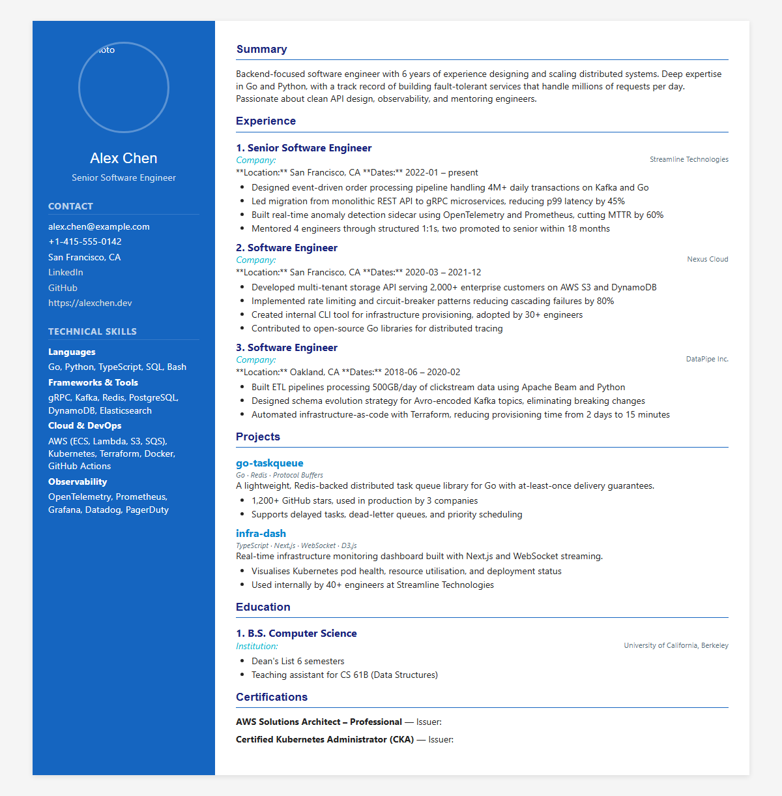
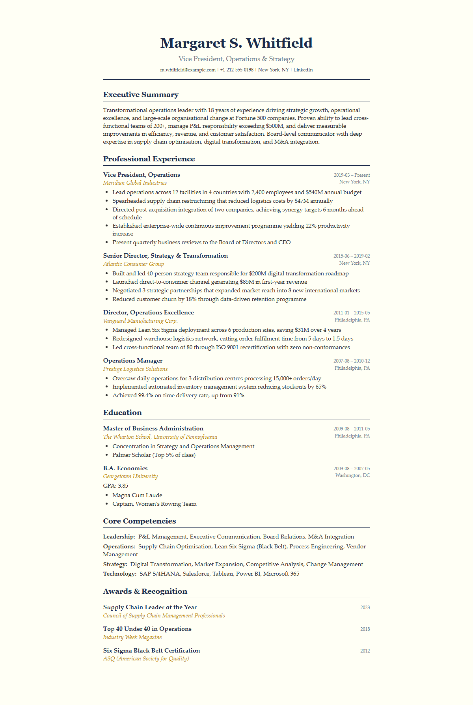
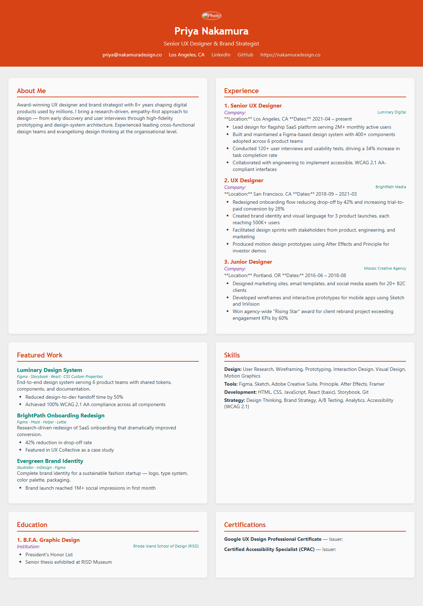
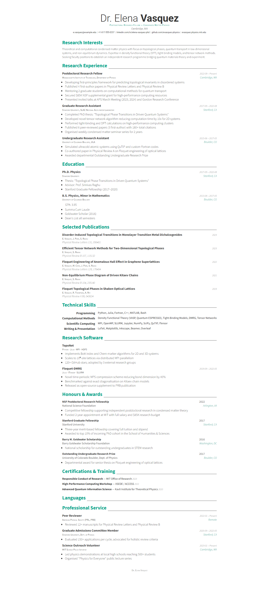
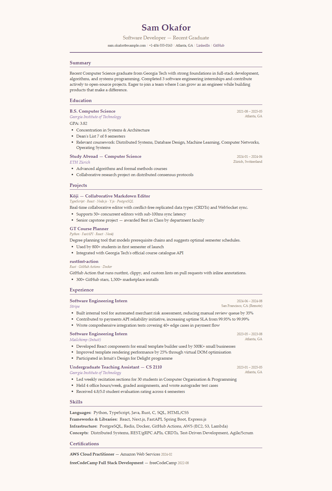
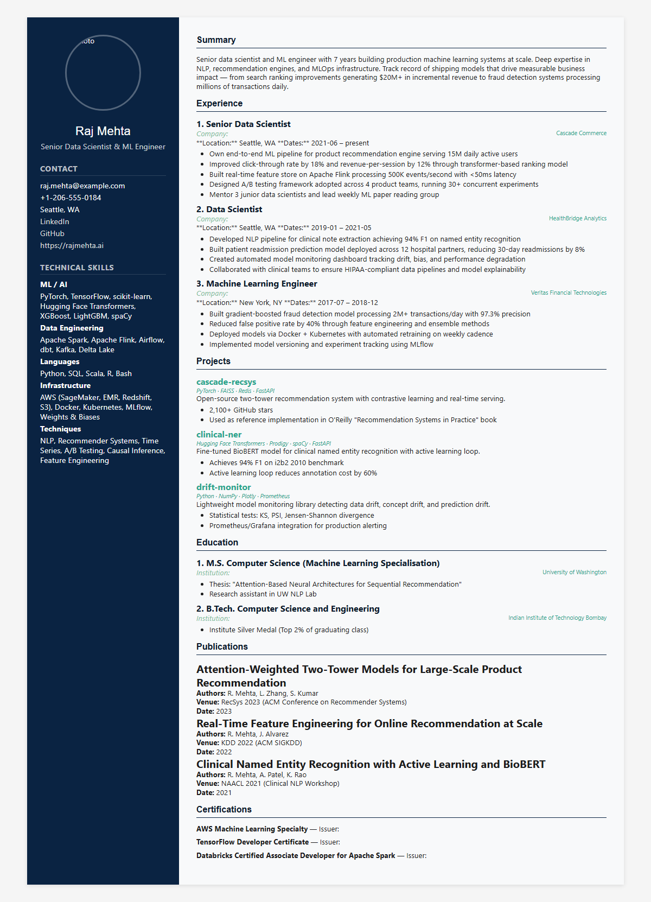

# Auto Resume — Example Gallery

Six complete example vaults showcasing different presets, layouts, and content types.
Each example is a self-contained vault you can build with `auto-resume build`.

---

## Available Presets (9 total)

| Preset | Style | Layout | Best For |
| --- | --- | --- | --- |
| `classic` | Serif, conservative slate/gray | top-header | Traditional industries |
| `modern` | Sans-serif, dark blue accents | sidebar | Tech & professional roles |
| `minimal` | Maximum whitespace, black/gray | top-header | Clean, understated profiles |
| `awesome-cv` | XeLaTeX class, bold headings | top-header | Academic CVs, research |
| `executive` | Navy + gold, serif Palatino | top-header | Senior leadership, C-suite |
| `creative` | Coral + teal, vibrant cards | cards | Design, marketing, creative |
| `academic` | Dense Times New Roman, dark red links | top-header | Professors, researchers |
| `technical` | Dark slate, green terminal accents | sidebar | Engineers, DevOps, SREs |
| `elegant` | Burgundy + warm cream, Palatino | top-header | Consulting, finance, law |

---

## Examples

### 1. Software Engineer — `modern` preset, sidebar layout



**Profile:** Alex Chen, Senior Software Engineer (San Francisco)
**Preset:** `modern` with blue/cyan customisation
**Layout:** Sidebar with photo
**Sections:** Summary, Experience, Skills, Projects, Education, Certifications
**Build:**

```bash
auto-resume build examples/software-engineer -f html -f latex -f docx
```

---

### 2. Executive — `executive` preset, top-header layout



**Profile:** Margaret S. Whitfield, VP Operations (New York)
**Preset:** `executive` with gold border accents
**Layout:** Top-header, no photo — formal and authoritative
**Sections:** Summary, Experience, Education, Skills, Awards
**Build:**

```bash
auto-resume build examples/executive -f html -f latex -f docx
```

---

### 3. Creative Designer — `creative` preset, cards layout



**Profile:** Priya Nakamura, Senior UX Designer (Los Angeles)
**Preset:** `creative` with coral/teal/purple palette
**Layout:** Cards grid with photo — portfolio-style
**Sections:** Summary, Experience, Featured Work, Skills, Education, Certifications
**Build:**

```bash
auto-resume build examples/creative-designer -f html -f latex -f docx
```

---

### 4. Academic Researcher — `awesome-cv` preset



**Profile:** Dr. Elena Vasquez, Postdoctoral Fellow (Cambridge, MA)
**Preset:** `awesome-cv` with emerald green accent
**Layout:** Top-header (awesome-cv XeLaTeX class for PDF)
**Sections:** Research Interests, Experience, Education, Publications, Skills, Awards
**Note:** PDF output requires XeLaTeX with Roboto & Source Sans Pro fonts
**Build:**

```bash
auto-resume build examples/academic-researcher -f html -f latex -f docx
```

---

### 5. New Graduate — `elegant` preset



**Profile:** Sam Okafor, Recent CS Graduate (Atlanta)
**Preset:** `elegant` with plum/purple customisation
**Layout:** Top-header, no photo — clean and polished
**Sections:** Summary, Education, Projects, Experience, Skills, Certifications
**Build:**

```bash
auto-resume build examples/new-graduate -f html -f latex -f docx
```

---

### 6. Data Scientist — `technical` preset, sidebar layout



**Profile:** Raj Mehta, Senior Data Scientist (Seattle)
**Preset:** `technical` with blue-green palette
**Layout:** Sidebar with photo
**Sections:** Summary, Experience, Skills, Projects, Education, Publications, Certifications
**Build:**

```bash
auto-resume build examples/data-scientist -f html -f latex -f docx
```

---

## Customising Styles

Every `_style.yml` shows how to override preset defaults:

```yaml
# Select a base preset
preset: modern

# Override specific colours
colors:
  primary: "#1565C0"
  accent: "#00BCD4"

# Change fonts
fonts:
  heading: Helvetica
  body: "Segoe UI"

# Pick a layout
html:
  layout: sidebar
  include_photo: true
```

See `auto-resume style-schema` for the full list of configurable options.

## Building All Examples

```bash
# Build all examples at once
for dir in examples/*/; do
  auto-resume build "$dir" -f html -f latex -f docx -o "$dir/output"
done
```

## Regenerating Preview Images

```bash
python examples/generate_previews.py
```

Requires `playwright` (`pip install playwright && playwright install chromium`).
